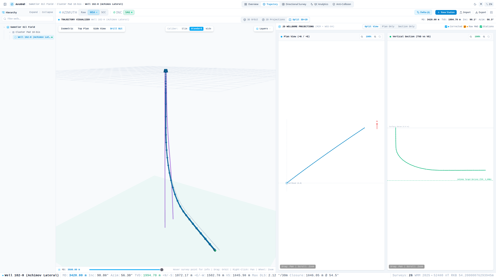
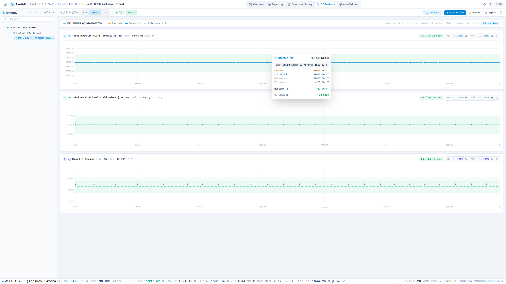
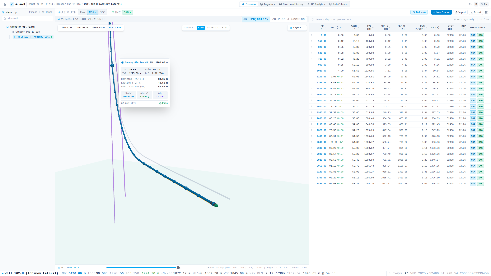
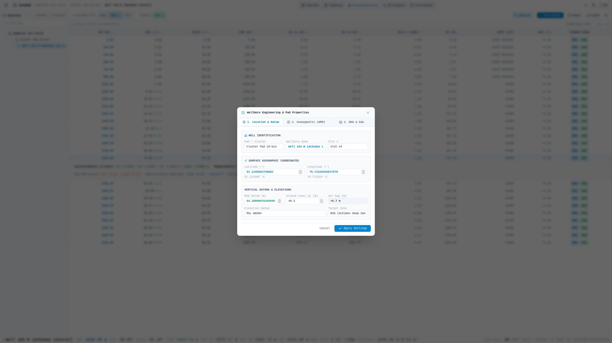
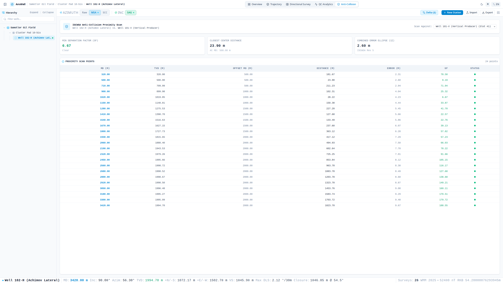

<div align="center">

# 🧭 ArroWell

**High-Performance Directional Drilling Survey Workstation & MWD Analytics Engine**

[](https://github.com/mwdstd/mwdstdcore)
[](https://www.python.org/)
[](https://fastapi.tiangolo.com/)
[](https://react.dev/)
[](https://threejs.org/)
[](https://duckdb.org/)
[](https://tailwindcss.com/)
[-brightgreen?style=flat&logo=pytest&logoColor=white)](https://docs.pytest.org/)
[](https://www.gnu.org/licenses/agpl-3.0)

<p align="center">
  A cloud-native, CAD-grade engineering workstation for directional wellbore trajectory calculation, 
  MWD sensor telemetry QA/QC, real-time geomagnetic & mechanical corrections (MSA, SAG, SCC), 
  and interactive 3D WebGL spatial visualization — <b>powered by the <code>mwdstdcore</code> computational engine</b>.
</p>

<p align="center">
  <a href="#key-features">Key Features</a> •
  <a href="#computational-core-mwdstdcore">mwdstdcore Integration</a> •
  <a href="#architecture--tech-stack">Architecture</a> •
  <a href="#quick-start">Quick Start</a> •
  <a href="#mathematical-foundation">Math & Physics Engine</a> •
  <a href="#api-endpoints">API Overview</a> •
  <a href="#project-structure">Project Structure</a>
</p>

</div>

---

## 🌟 Key Features

### 1. 3D WebGL & 2D Projection Workstation
<p align="center">
  
</p>

- **Interactive 3D Orbit View (Three.js)**: True-to-scale wellbore diameter rendering (`Slim`, `Standard`, `Wide`), BHA drill-bit assembly oriented along trajectory tangent vectors using spatial quaternions, offset wells, and target payzone horizons.
- **Zero-Jitter Hover Raycaster**: High-precision invisible hit-spheres for smooth, instantaneous station telemetry inspection without cursor stutter.
- **2D Engineering Projections (SVG)**: Synchronized Plan View ($+N / +E$) and Vertical Section View ($TVD \text{ vs. } VS$) with pan, wheel zoom, and real-time cursor coordinate transformation.
- **CAD-Grade Telemetry HUD**: Live status bar tracking bottom-hole metrics in real time (MD, Inc, Azim, TVD, VS, Max DLS, Closure distance, and active RKB datum).

### 2. MWD Sensor Diagnostics & QA/QC Dashboard
<p align="center">
  
</p>

- **Real-Time Sensor Corridors**: Continuous validation of tri-axial accelerometer ($G_x, G_y, G_z$) and magnetometer ($B_x, B_y, B_z$) telemetry against reference global geomagnetic models (**WMM 2025, IGRF, HDGM, BGGM**).
- **Interactive High-Density SVG Charts**: Independent axis zooming (`Wheel` for MD depth stretch, `Shift + Wheel` for value resolution) with cursor-following inspection tooltips.

### 3. Advanced Directional Corrections Suite
<p align="center">
  
</p>

- **Multi-Station Analysis (MSA)**: Drillstring magnetization calibration powered by `mwdstdcore` stochastic **Differential Evolution** global optimization (`de_correct`), resolving axial magnetic bias ($\Delta B_z$), cross-axial biases ($B_x, B_y$), and sensor misalignments.
- **BHA Gravity Sag (SAG)**: Analytical fourth-order beam deflection solver (`mwdstdcore.sag.sagcor`) accounting for collar stiffness ($EI$), stabilizer spacing, fluid buoyancy, and local borehole curvature (DLS).
- **Short Collar Correction (SCC)**: Non-magnetic drill collar interference compensation.
- **Non-Blocking Execution**: Background calculation with subtle pulsing button indicators (`animate-ping` / `animate-pulse`) in the command ribbon instead of intrusive screen-blocking modals.

### 4. Unified 3-Tab Engineering Settings Modal
<p align="center">
  
</p>

- 📍 **1. Location & Geodesy**: Surface coordinates (Latitude, Longitude), elevation datums (Rotary Kelly Bushing **RKB**, Ground Level **GL**), air gap ($RKB - GL$), well slot assignment, and target reservoir formation.
- 🧭 **2. Geomagnetic Reference (WMM)**: One-click **"Auto WMM from Coords"** button that computes spherical harmonics and Somigliana gravity directly from Tab 1 coordinates via backend `mwdstdcore`.
- 🏗 **3. BHA & Mud Properties (SAG)**: Presets (`6-3/4"`, `4-3/4" Slim`, `8" Heavy`), collar OD/ID, stabilizer spacing, sensor-to-bit distance, fluid density $\rho_{\text{mud}}$, and live beam deflection preview.

### 5. ISCWSA Anti-Collision Proximity Scan
<p align="center">
  
</p>

- Automated proximity scanning against offset wellbores using the **ISCWSA Rev 5** error model.
- Real-time computation of **Separation Factor (SF)**, closest approach distance, and combined $1\sigma$ positional uncertainty ellipsoids.

### 6. Industry-Standard Data Exchange
- Built-in parsers and exporters for **Halliburton Landmark COMPASS (.txt)**, **CWLS LAS 2.0 (.las)**, CSV, structured JSON, and print-ready **official HTML/PDF survey reports**.
- **Offline-First Resilience**: Seamless client-side fallback engine ensuring full functionality even if network connectivity to the backend is lost.

---

## 🔬 Computational Core: `mwdstdcore`

ArroWell delegates all rigorous directional surveying mathematics and telemetry processing to **[`mwdstdcore`](https://github.com/mwdstd/mwdstdcore)**:

- **Minimum Curvature Method (`mwdstdcore.core.common.mincurv`)**: Exact spatial 3D coordinate integration (North, East, TVD) with tie-in support and Ratio Factor ($RF$) spherical arc interpolation.
- **Differential Evolution MSA Solver (`mwdstdcore.core.diffev.de_correct`)**: Vectorized global optimization resolving drillstring magnetization biases using particle populations.
- **A Priori Covariance Modeling (`mwdstdcore.msa.covan`)**: Dynamic uncertainty matrix configuration based on toolface coverage and drillstring rigidity.
- **BHA Beam Deflection Solver (`mwdstdcore.sag.sagcor`)**: Finite-difference coordinate descent solving Euler-Bernoulli beam bending under gravitational and buoyant loads.
- **Spherical Harmonic Geomagnetics (`mwdstdcore.gmag`)**: Rigorous spherical harmonic expansion computing total field ($B_{\text{total}}$), dip angle ($\theta_{\text{dip}}$), declination, grid convergence, and Somigliana normal gravity ($G_{\text{total}}$).

---

## 🏗 Architecture & Tech Stack

```
                                      ┌─────────────────────────────────────┐
                                      │        ArroWell Frontend            │
                                      │  React 19 • Three.js • TypeScript   │
                                      │      Tailwind CSS v4 • Vite         │
                                      └──────────────────┬──────────────────┘
                                                         │ HTTP REST / JSON
                                                         ▼
┌───────────────────────────────────────────────────────────────────────────┐
│                           ArroWell Backend                                │
│                     FastAPI • Pydantic v2 • SQLAlchemy 2.0                │
├───────────────────────────────┬───────────────────────────────────────────┤
│       Data Storage            │             Math & Analytics              │
│  DuckDB Columnar Storage      │     mwdstdcore Computational Engine       │
│  (Persistent / In-Memory)     │     • mincurv (Minimum Curvature)         │
│                               │     • de_correct (Differential Evolution) │
│                               │     • sagcor (Euler-Bernoulli Sag)        │
│                               │     • gmag_point (Spherical Harmonics)    │
└───────────────────────────────┴───────────────────────────────────────────┘
```

| Layer | Technologies | Responsibility |
| :--- | :--- | :--- |
| **Computational Core** | **`mwdstdcore`** | Minimum Curvature Method, Differential Evolution MSA, BHA Sag beam solver, WMM/IGRF geomagnetics. |
| **Backend API** | Python 3.11+, FastAPI, SQLAlchemy 2.0, DuckDB, `uv` | REST API, DuckDB persistence, survey validation schemas, automated test suite. |
| **Frontend UI** | React 19, TypeScript, Three.js, Vite 8, Tailwind CSS v4 | 3D/2D visualizers, high-density data tables, interactive SVG charts, client-side fallback engine. |
| **DevOps** | Docker, Docker Compose, Nginx (Alpine) | Multi-stage container builds, persistent volume mapping, production reverse-proxying. |

---

## 🧮 Mathematical Foundation

All directional drilling mathematics conform strictly to **ISCWSA / API RP 78** standards:

### 1. Minimum Curvature Method (MCM)
Implemented via `mwdstdcore.core.common.mincurv.mincurv`. For consecutive survey stations $1$ and $2$ across measured depth interval $\Delta MD = MD_2 - MD_1$:

$$\Delta DL = \arccos\left(\cos(I_2 - I_1) - \sin I_1 \sin I_2 [1 - \cos(A_2 - A_1)]\right)$$

$$RF = \frac{2}{\Delta DL} \tan\left(\frac{\Delta DL}{2}\right) \quad (\text{Ratio Factor})$$

$$\Delta TVD = \frac{\Delta MD}{2} (\cos I_1 + \cos I_2) \cdot RF$$

$$\Delta North = \frac{\Delta MD}{2} (\sin I_1 \cos A_1 + \sin I_2 \cos A_2) \cdot RF$$

$$\Delta East = \frac{\Delta MD}{2} (\sin I_1 \sin A_1 + \sin I_2 \sin A_2) \cdot RF$$

$$DLS = \left( \frac{\Delta DL \times 30}{\Delta MD} \right) \times \frac{180}{\pi} \quad [^{\circ}/30\text{m}]$$

### 2. Multi-Station Analysis (MSA)
Implemented via `mwdstdcore.core.diffev.de_correct.de_correct`. Eliminates drillstring-induced axial magnetic interference $\Delta B_z$:

$$\vec{B}_{\text{cor}} = \begin{bmatrix} B_x \\ B_y \\ B_z - \Delta B_z \end{bmatrix}, \quad B_{\text{total}} = \sqrt{B_x^2 + B_y^2 + (B_z - \Delta B_z)^2}$$

The analytical azimuth sensitivity conforms to the **ISCWSA MWD error model**:

$$\Delta A_m \approx \frac{\Delta B_z \cdot \sin(I) \cdot \sin(A_m)}{B_{\text{total}} \cdot \cos(\theta_{\text{dip}})} = \frac{\Delta B_z \cdot \sin(I) \cdot \sin(A_m)}{B_H}$$

Where $B_H = B_{\text{total}} \cos(\theta_{\text{dip}})$ is the horizontal geomagnetic field component, vanishing at zero inclination ($I = 0^\circ$) or magnetic North/South orientations ($A_m = 0^\circ, 180^\circ$).

### 3. BHA Gravity Sag Deflection (SAG)
Implemented via `mwdstdcore.sag.sagcor.sagcor`. Resolves gravitational drooping of the sensor package between stabilizers via fourth-order Euler-Bernoulli beam bending:

$$EI(z) \frac{d^4 y}{dz^4} = q_{\text{eff}}(z) \cdot \sin(I)$$

Where:
- $EI(z) = E \cdot \frac{\pi (OD^4 - ID^4)}{64}$ is the flexural rigidity of the collar sections (structural vs. non-magnetic steel).
- $q_{\text{eff}} = Q(z) \left(1 - \frac{\rho_{\text{mud}}}{\rho_{\text{steel}}}\right)$ is the effective linear weight in buoyant drilling fluid.
- The angular deflection at MWD sensor position $z_{\text{mwd}}$ is computed by finite-difference coordinate descent:

$$\text{Sag} = -\frac{dy}{dz} \Bigg|_{z = z_{\text{mwd}}}$$

---

## 🔌 API Endpoints

| Method | Endpoint | Description |
| :--- | :--- | :--- |
| `GET` | `/health` | Service uptime and database filepath status. |
| `GET` | `/api/v1/wells/hierarchy` | Full oilfield tree: Field $\rightarrow$ Pad $\rightarrow$ Wellbore. |
| `GET` | `/api/v1/wells/{well_id}/stations` | Retrieve all directional survey stations for a wellbore. |
| `POST` | `/api/v1/wells/{well_id}/stations` | Add a survey station, recalculate trajectory via `mwdstdcore`, and persist to DuckDB. |
| `DELETE` | `/api/v1/wells/{well_id}/stations/{id}` | Delete a survey station from DuckDB. |
| `POST` | `/api/v1/wells/{well_id}/run-msa` | Execute `mwdstdcore` differential evolution MSA optimization. |
| `POST` | `/api/v1/wells/{well_id}/run-sag` | Execute `mwdstdcore` analytical BHA Sag beam bending calculation. |
| `POST` | `/api/v1/wells/calculate-geomag-reference` | Compute exact WMM/IGRF field, dip, declination, and gravity from Lat/Lon. |
| `POST` | `/api/v1/surveys/calculate-trajectory` | On-the-fly 3D Minimum Curvature calculation from raw station angles. |

---

## 🚀 Quick Start

### Option A: Run with Docker Compose (Recommended)

Start the entire workstation (FastAPI Backend + React Frontend + Nginx) with a single command:

```bash
docker compose up --build
```

- **Frontend Workstation**: Open [http://localhost:3000](http://localhost:3000)
- **FastAPI Interactive Docs (Swagger)**: Open [http://localhost:8000/docs](http://localhost:8000/docs)
- **Health Check**: Open [http://localhost:8000/health](http://localhost:8000/health)

---

### Option B: Local Development Setup

#### 1. Backend Setup

The backend uses [`uv`](https://github.com/astral-sh/uv) for fast, reproducible Python dependency management.

```bash
cd backend

# Install dependencies into virtual environment (including mwdstdcore)
uv sync

# Run the FastAPI server
uv run uvicorn main:app --app-dir src --host 0.0.0.0 --port 8000 --reload
```

Run the backend test suite:
```bash
uv run pytest
```
*(All 8 tests execute against an isolated in-memory DuckDB database in ~11 seconds)*

#### 2. Frontend Setup

```bash
cd frontend

# Install Node modules
npm install

# Start Vite development server
npm run dev
```

Visit [http://localhost:3000](http://localhost:3000) in your browser.

---

## 📂 Project Structure

```text
.
├── backend/
│   ├── data/                    # Persistent DuckDB storage volume
│   ├── src/
│   │   ├── api/v1/              # REST route controllers (surveys, wells, geomag)
│   │   ├── core/                # App config, CORS policy, DuckDB engine, seed runner
│   │   ├── crud/                # Database operations & cascade trajectory recomputation
│   │   ├── models/              # SQLAlchemy 2.0 ORM models (Field, Pad, Well, Station)
│   │   ├── schemas/             # Pydantic v2 validation & telemetry serialization schemas
│   │   ├── services/            # Directional core (mwdstdcore MCM, MSA solver, BHA SAG)
│   │   └── main.py              # FastAPI application entrypoint & lifespan management
│   ├── tests/                   # Pytest suite (In-memory DuckDB, API & math verification)
│   │   ├── conftest.py          # Pytest fixtures & isolated in-memory DB setup
│   │   ├── test_api.py          # Integration tests (hierarchy, cascade updates, MSA/SAG)
│   │   └── test_directional.py  # Mathematical MCM verification tests
│   ├── Dockerfile               # Multi-stage Python 3.11 container with uv package manager
│   └── pyproject.toml           # Project dependencies & tool configurations
│
├── frontend/
│   ├── src/
│   │   ├── components/
│   │   │   ├── layout/          # HeaderNav, SidebarTree, StatusBar
│   │   │   ├── modals/          # AddSurvey, Import, Export, GeomagneticSettings (3-tab)
│   │   │   └── workbench/       # Trajectory3D (WebGL), Projections2D (SVG), SensorQC,
│   │   │                        # SurveyLogTable, AntiCollisionScan, TrajectoryWorkspace
│   │   ├── context/             # Domain context adapters (UI, Engineering, Survey facade)
│   │   ├── data/                # Sample oilfield survey datasets & offset wells
│   │   ├── store/               # Zustand global store with persistence & atomic selectors
│   │   ├── types/               # TypeScript definitions (stations, sensors, geometry)
│   │   ├── utils/               # API client, Minimum Curvature math, file parsers, i18n
│   │   ├── App.tsx              # Master layout and workstation orchestrator
│   │   ├── index.css            # Tailwind CSS v4 styling & engineering design tokens
│   │   └── main.tsx             # Application bootstrap & DOM mount
│   ├── Dockerfile               # Multi-stage production Nginx container build
│   ├── package.json             # React 19, Three.js, Zustand, Tailwind v4 dependencies
│   ├── tsconfig.json            # Strict TypeScript compiler options
│   └── vite.config.ts           # Vite 8 bundler configuration with Tailwind plugin
│
├── docker-compose.yml           # Production multi-container orchestration
├── LICENSE                      # GNU AGPL-3.0 License
└── README.md                    # Comprehensive technical documentation & benchmarks
```

---

## 📄 License & Attribution

This project is licensed under the terms of the **GNU Affero General Public License v3.0 (AGPL-3.0)**. See the [LICENSE](LICENSE) file for details.

Directional trajectory integration, geomagnetic reference modeling, and MWD analytical algorithms are powered by **[`mwdstdcore`](https://github.com/mwdstd/mwdstdcore)**.

```