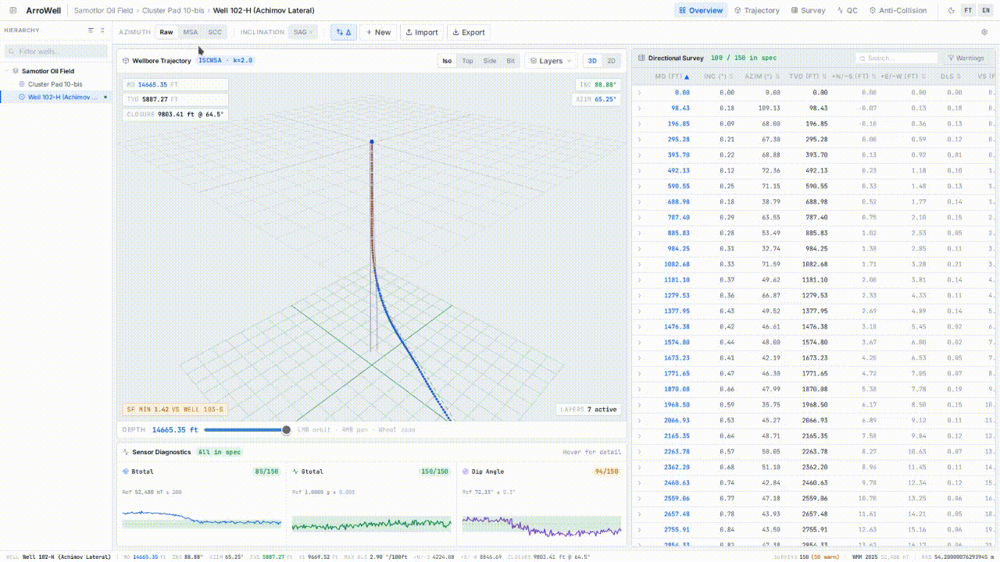

<div align="center">

#  

**High-Performance Directional Drilling Survey Workstation & MWD Analytics Platform**

[](arrowell_engine/)
[](https://www.python.org/)
[](https://fastapi.tiangolo.com/)
[](https://react.dev/)
[](https://threejs.org/)
[](https://duckdb.org/)
[](https://tailwindcss.com/)
[-brightgreen?style=flat&logo=pytest&logoColor=white)](https://docs.pytest.org/)
[](#-engine-performance-benchmarks)
[](LICENSE)
[](https://www.linkedin.com/in/maksim-nikitin-1427ba203/)

<p align="center">
  A cloud-native, CAD-grade engineering workstation for directional wellbore trajectory calculation, 
  MWD sensor telemetry QA/QC, high-definition continuous inclination fusion, ISCWSA 3D anti-collision clearance scanning, 
  and real-time physical calibration (MSA, BHA Sag, SCC) — <b>powered by the native <code>arrowell_engine</code> computational kernel</b>.
</p>

<p align="center">
  <a href="#key-features">Key Features</a> •
  <a href="#-engine-performance-benchmarks">Benchmarks</a> •
  <a href="#computational-core-arrowell_engine">arrowell_engine</a> •
  <a href="#architecture--tech-stack">Architecture</a> •
  <a href="#mathematical-foundation">Math & Physics</a> •
  <a href="#quick-start">Quick Start</a> •
  <a href="#api-endpoints">API Overview</a> •
  <a href="#project-structure">Project Structure</a> •
  <a href="#author">Author</a>
</p>

<!-- Demo GIF Showcase -->
<p align="center">
  
</p>

</div>

---

## 🌟 Key Features

### 1. 3D WebGL Orbit Visualizer & Synchronized 2D Projections
<p align="center">
  
</p>

- **Hardware-Accelerated 3D Orbit (Three.js)**: Smooth rendering of primary trajectory, raw uncorrected surveys, planned wellpaths, and multi-well offset clusters using smooth 3D Catmull-Rom splines at 60–120 FPS.
- **ISCWSA 3D Ellipsoids of Uncertainty (EOU)**: Direct 3D spatial rendering of wireframe and solid error ellipsoids aligned tangentially along the wellbore axis via quaternion coordinate rotations (`THREE.Quaternion.setFromUnitVectors`).
- **Real-Time Depth Scrubber**: Interactive slider dynamically updating GPU buffer draw ranges (`geometry.setDrawRange`) to inspect well profiles and bit positions at any measured depth ($MD$).
- **CAD Camera Presets & Precision HUD**: Instant viewpoint switches (`Iso`, `Top`, `Side`, `Bit Focus`) accompanied by floating telemetry readouts ($MD$, $TVD$, $Inc$, $Azim$, $Closure$).
- **Synchronized 2D Vector Projections (SVG)**: High-resolution Plan View ($+N \text{ vs. } +E$) and Vertical Section View ($TVD \text{ vs. } VS$) featuring pan, wheel zoom, inverse cursor coordinate projection into real-world meters, target horizon planes, and true 1:1 EOU ellipse footprints.

### 2. MWD Sensor Diagnostics & Tolerance Corridors
<p align="center">
  
</p>

- **Multi-Sensor QA/QC Dashboard**: Continuous validation of total gravitational field ($G_{\text{total}}$), geomagnetic field intensity ($B_{\text{total}}$), and magnetic dip angle ($Dip$) along the wellbore.
- **Dynamic Acceptance Corridors**: Automatically calculated multi-sigma tolerance envelopes based on global geomagnetic standards (**WMM2025**, **IGRF-14**, **WMMHR2025**) and local sensor noise baselines.
- **Dual-Axis Independent Zooming**: Native SVG inspection allowing independent depth stretching ($MD$ axis) and measurement amplitude scaling (value axis) with interactive cursor inspection tooltips.
- **Compact Overview Strip**: High-density 3-cell diagnostic strip in the primary overview layout for rapid station pass/fail monitoring while analyzing trajectories.

### 3. Physical Calibration & Correction Suite
<p align="center">
  
</p>

- **Multi-Station Analysis (MSA)**: High-precision 18-parameter calibration solving for 15 sensor terms (triaxial accelerometer/magnetometer biases, scale factors, and sensor block cross-axis misalignments $M_{xy}, M_{xz}, M_{yz}$) plus 3 reference field residual deltas ($\Delta G, \Delta B, \Delta Dip$).
- **Dual MSA Optimization Engines**:
  - **TRF (Trust Region Reflective)**: High-speed Non-Linear Least Squares gradient search with Bayesian a priori regularization for rapid drillstring magnetization decoupling.
  - **DE (Differential Evolution)**: Stochastic genetic global optimizer engineered for complex magnetic anomalies and challenging survey distributions.
- **Toolface Coverage Analysis**: Automated validation of Gravity Toolface (GTF) angular distribution; identifies rotational gaps ($> 100^\circ$) to constrain cross-axial bounds and prevent overfitting during motor sliding intervals.
- **BHA Gravity Sag Correction (SAG)**: Analytical Euler-Bernoulli beam deflection solver resolving drillstring elasticity ($EI$), fluid hydrostatic buoyancy, local wellbore curvature ($DLS$), and **bilateral borehole wall contact boundaries** (preventing artificial deflection beyond the borehole low-side wall). Reduces residual sag uncertainty to $\le 0.08^\circ$ (1-sigma).
- **Short Collar Correction (SCC)**: Rapid single-station cross-axial magnetic reconstruction for survey intervals with localized magnetic interference.
- **Singularity Protection**: Analytical vertical locks locking indeterminate azimuths when inclination drops below $Inc < 0.1^\circ$, suppressing noise-induced azimuth spinning.

### 4. High-Definition Continuous Inclination (CI) Trajectory Fusion
- **Dynamic Linear Offset Balancing**: Fuses discrete, high-accuracy static connection surveys (every 30 m) with high-frequency continuous inclination streams (streamed while drilling/rotating every 0.5–2 m).
- **Curvature-Weighted Azimuth Distribution**: Spreads directional azimuth shifts proportionally over actual dogleg intervals rather than assuming uniform geometric curvature.
- **TVD-Bounded Douglas-Peucker Thinning**: Compresses high-density survey streams by up to ~95% while strictly guaranteeing vertical depth fidelity within $\le 0.05 \text{ m}$ ($\le 5 \text{ cm}$).

### 5. ISCWSA 3D Position Uncertainty & Anti-Collision Scan
<p align="center">
  
</p>

- **ISCWSA / OWSG Error Propagation (SPE 67616)**: Full implementation of standardized error models (**ISCWSA MWD Rev 4, Rev 5.11, MWD+SAG, IFR1/2**) with analytical weighting functions for depth, sensor, misalignment, and geomagnetic terms.
- **Full NEV Covariance Synthesis**: Rigorous accumulation across Random, Systematic, and Global error modes into complete $3 \times 3$ covariance matrices ($\Sigma_{NEV}$) with spectral eigen-decomposition into 3D semi-axes.
- **Separation Factor ($SF$) Calculation**: True 3D projection of combined uncertainty along the unit line of closest approach ($\vec{u}^T \Sigma \vec{u}$) between subject and offset wellbores:
  $$SF = \frac{D_{\text{center}} - (R_{\text{subj}} + R_{\text{off}})}{k \cdot (\sigma_{\text{subj}} + \sigma_{\text{off}})}$$
- **Clearance & Proximity Warnings**: Live status classification (`SAFE` for $SF \ge 1.5$, `WARNING` for $1.0 \le SF < 1.5$, and `CRITICAL` collision alert for $SF < 1.0$) with center-to-center and borehole surface clearance metrics.

### 6. Interactive Survey Passport & Directional Log
- **Comprehensive Survey Table**: Tabular view of directional stations featuring sortable headers, depth filtering, QC status indicators, and dogleg severity coloring.
- **Differential Delta ($\Delta$) Indicators**: Instant visual toggle displaying coordinate and angle deviations between raw telemetry and corrected profiles ($+N, +E, TVD, Inc, Azim$).
- **Expandable Survey Station Passport**: One-click row expansion revealing a comprehensive 4-card engineering breakdown:
  1. *Coordinate Shifts*: Raw vs. corrected Northing, Easting, TVD, $\Delta \text{Horiz}$, and total 3D spatial shift.
  2. *Angle Corrections*: Raw vs. corrected Inclination, Azimuth, and resulting Dogleg Severity.
  3. *Accelerometer Verification*: Triaxial $G_x, G_y, G_z$ readings, $G_{\text{total}}$, and gravity delta $\Delta G$.
  4. *Magnetometer Verification*: Triaxial $B_x, B_y, B_z$ readings, $B_{\text{total}}$, magnetic delta $\Delta B$, and dip delta $\Delta Dip$.

### 7. Unified 4-Tab Engineering Settings Modal
<p align="center">
  
</p>

- 📍 **1. Wellhead & Datum**: Well identification (Pad, Well, Slot), geodetic WGS-84 coordinates (Latitude, Longitude), elevation datums (Rotary Kelly Bushing **RKB**, Ground Level **GL**), air gap calculation, and target formation.
- 🧭 **2. Geomagnetic Model**: Select between **WMM2025**, **IGRF-14**, and **HDGM** standards; features a one-click **"Auto WMM from Coords"** button calculating total field, dip angle, declination, and meridian grid convergence via backend spherical harmonics.
- 🏗 **3. BHA & Sag Mechanics**: Standard collar presets (`6-3/4"`, `4-3/4" Slim`, `8" Heavy`), custom outer/inner diameters, stabilizer distances, bit-to-sensor offsets, mud density, collar material selection, and live theoretical deflection previews.
- ⚡ **4. MSA Solver Engine**: Solver selection (`TRF` non-linear least squares vs. `DE` global genetic search), iteration limits, population size multipliers, and calibration degrees of freedom (sensor misalignments and reference field adjustments).

### 8. Industry Data Exchange & Offline-First Resilience
- **Comprehensive Exporters**: Direct export to **Halliburton Landmark COMPASS (.txt)**, **CWLS LAS 2.0 (.las)**, standard **CSV**, structured **JSON**, and printable/PDF-ready **HTML directional survey reports**.
- **Flexible Survey Importer**: Automated parsing of CSV, tab-delimited, whitespace-delimited, and Landmark survey text dumps with header auto-detection.
- **Dual-Engine Architecture (Online & Offline Resilience)**: Fully operational when connected to the high-performance FastAPI/DuckDB backend, with a built-in browser-side computation fallback (`directionalMath.ts`, `geomagneticEngine.ts`) ensuring uninterrupted field work if network connections drop.

---

## ⚡ Engine Performance Benchmarks

Empirically measured with `pytest-benchmark 5.3` on Linux x86_64 (Python 3.11):

| Computational Module | Workload / Dataset Size | Mean Latency | Throughput (OPS) | Performance Profile |
| :--- | :--- | :--- | :--- | :--- |
| **MCM Trajectory (NumPy)** | 100 survey stations | **~58.8 μs** | **17,015 ops/s** | Vectorized Sawaryn-Thorogood $\mathcal{O}(N)$ |
| **MCM Trajectory (NumPy)** | 1,000 survey stations | **~204.4 μs** | **4,892 ops/s** | Zero-latency 120 FPS WebGL resync |
| **MCM Trajectory (NumPy)** | 10,000 survey stations | **~2.02 ms** | **493 ops/s** | Ultra-deep ERD wellbore scale |
| **BHA Gravity Sag Solver** | Pinned-pinned beam ODE | **~437.1 μs** | **2,288 ops/s** | Analytical contact mechanics solver |
| **Continuous Inc Fusion** | 2,000 streaming CI points | **~11.78 ms** | **84.9 ops/s** | 95.4% mesh compression (TVD $\le 5$ cm) |
| **ISCWSA 3D Uncertainty** | 500 stations (3D EOU) | **~139.2 ms** | **7.2 ops/s** | Covariance synthesis & Eigen-decomposition |
| **Geomag WMM2025 Harmonics**| 500 spatial 3D points | **~300.2 ms** | **3.3 ops/s** | Degree 12 Schmidt-normalized Legendre |
| **MSA Global Optimization**| 6-station D&I sensor run | **~776.2 ms** | **1.3 ops/s** | Differential Evolution + L-BFGS-B polishing |

---

## 🔬 Computational Core: `arrowell_engine`

ArroWell relies on its own high-performance, clean-room computational engine (**[`arrowell_engine`](arrowell_engine/)**), built with pure NumPy and SciPy:

```text
arrowell_engine/
├── geomag/          # Spherical harmonics (WMM2025/IGRF-14), Schmidt quasi-normalization, model compilers
├── msa/             # Multi-Station Analysis calibration engine & toolface distribution filters
├── sag/             # BHA beam bending solver with bilateral borehole contact boundaries
├── sensors/         # Sensor error models, tri-axial transforms, vertical singularity locks
├── trajectory/
│   ├── mcm.py       # Vectorized Minimum Curvature Method (Sawaryn & Thorogood)
│   ├── continuous.py# High-Definition Continuous Inclination fusion & TVD-bounded thinning
│   └── uncertainty.py# ISCWSA 3D position error propagation, EOU eigen-analysis, and Separation Factor (SF)
└── coords.py        # WGS-84 geodetic transformations and UTM meridian grid convergence
```

---

## 👤 Author

Developed by Maksim Nikitin

[](https://www.linkedin.com/in/maksim-nikitin-1427ba203/)