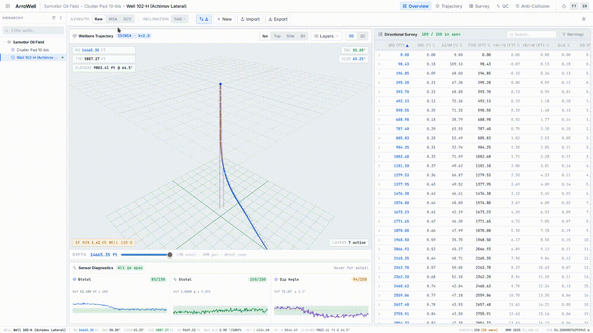
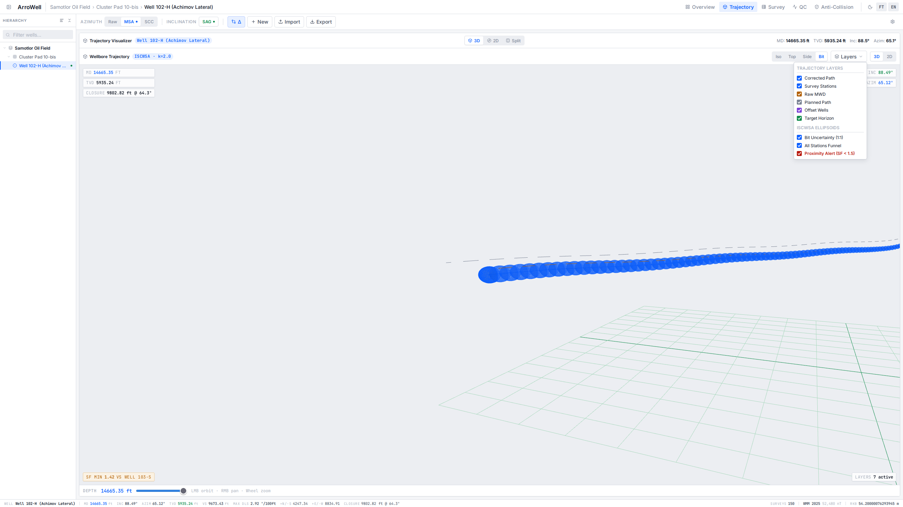
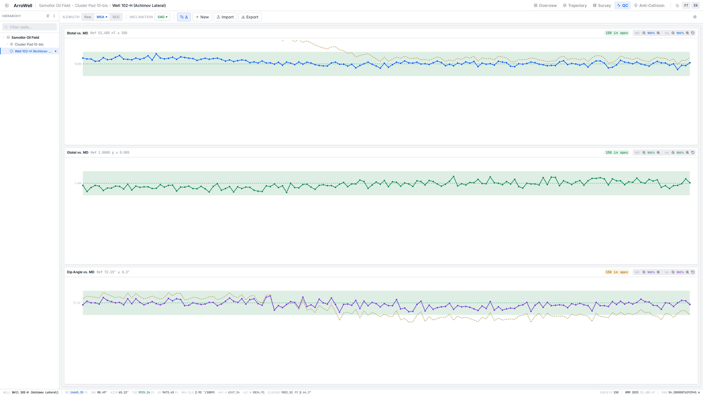
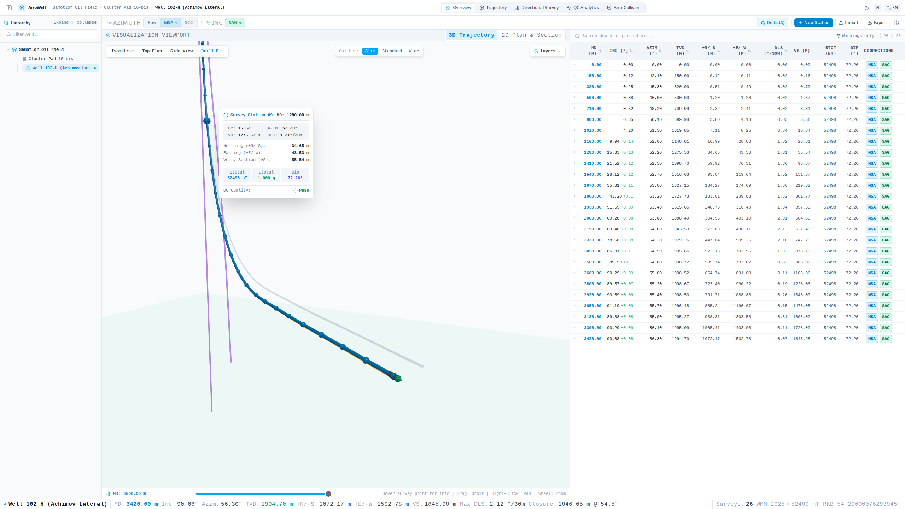
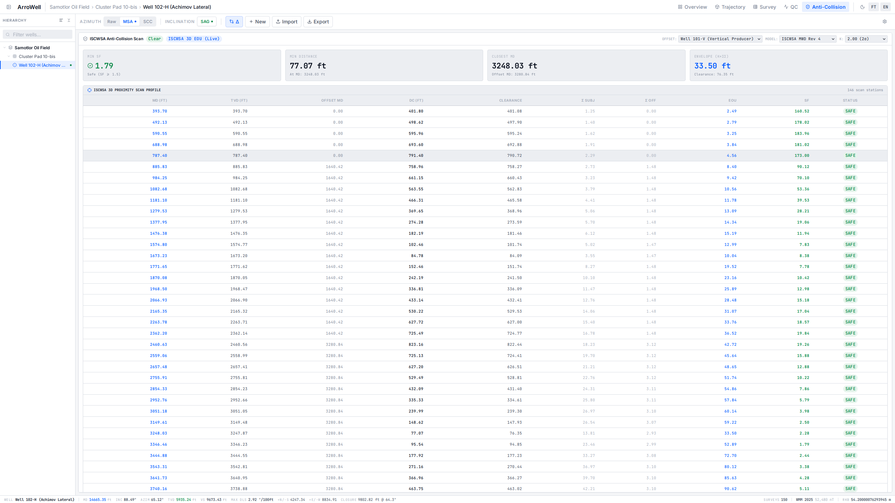
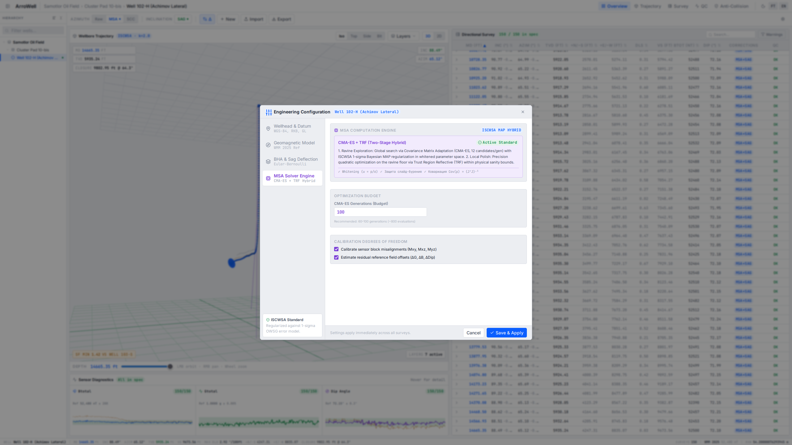

<div align="center">

# 

### Next-Generation Directional Drilling Survey Workstation & Real-Time MWD Analytics Platform

[](arrowell_engine/)
[](https://www.python.org/)
[](https://fastapi.tiangolo.com/)
[](https://duckdb.org/)
[](https://react.dev/)
[](https://threejs.org/)
[](https://tailwindcss.com/)
[-brightgreen?style=flat&logo=pytest&logoColor=white)](https://docs.pytest.org/)
[](#-performance-benchmarks)
[](LICENSE)
[](https://www.linkedin.com/in/maksim-nikitin-1427ba203/)

<p align="center">
  <b>ArroWell</b> is an open, cloud-native engineering workstation engineered for mission-critical wellbore positioning, downhole telemetry QA/QC, high-definition continuous inclination reconstruction, and dynamic 3D anti-collision clearance scanning.
</p>
<p align="center">
  <i>Powered by the high-performance Python/NumPy/SciPy computational engine: <b><code>arrowell_engine</code></b>.</i>
</p>

<p align="center">
  <a href="#-core-capabilities">Capabilities</a> •
  <a href="#-performance-benchmarks">Benchmarks</a> •
  <a href="#-computational-core-arrowell_engine">arrowell_engine</a> •
  <a href="#-mathematical--physical-framework">Math & Physics</a> •
  <a href="#-architecture--data-flow">Architecture</a> •
  <a href="#-quick-start">Quick Start</a> •
  <a href="#-data-exchange-formats">I/O Specs</a> •
  <a href="#-author">Author</a>
</p>

<p align="center">
  
</p>

</div>

---

## 🚀 Overview

Modern directional drilling demands millimeter-grade mathematical rigor, millisecond-level telemetry turnaround, and zero tolerance for positional ambiguity. Legacy desktop packages frequently suffer from proprietary lock-in, sluggish CPU graphics, and opaque black-box solvers.

**ArroWell** bridges the gap between field-level MWD operations and enterprise geonavigation:
- **Client-Side CAD Graphics**: High-framerate WebGL/Three.js 3D viewport combined with synchronized 2D vector projections (Plan and Vertical Section) rendering true 1:1 error ellipses.
- **Rigorous Sensor Analytics**: Multi-sigma physical boundary validation for triaxial accelerometers ($G_x, G_y, G_z$) and magnetometers ($B_x, B_y, B_z$) against authoritative geomagnetic models (**WMM2025**, **IGRF-14**, **WMMHR2025**).
- **Industrial In-Situ Calibration**: Native implementation of two-stage hybrid Multi-Station Analysis (**LRA-CMA $\to$ TRF**), analytical BHA Sag mechanics with borehole low-side contact constraints, and Short Collar Correction (**SCC**).
- **ISCWSA-Compliant Proximity Analysis**: Full 3D Ellipsoid of Uncertainty (**EOU**) spectral eigen-decomposition and live anti-collision clearance vector calculation across complex multi-well pads.

---

## 🌟 Core Capabilities

### 1. 3D WebGL Spatial Engine & Synchronized Vector Projections
<p align="center">
  
</p>

- **GPU-Accelerated 3D Viewport**: Smooth rendering of complex 3D profiles (primary bore, raw telemetry baselines, sidetracks, planned wellpaths, and multi-well offset clusters) via Catmull-Rom splines at 60–120 FPS.
- **Spatial ISCWSA Error Ellipsoids**: True 3D wireframe and solid error volume visualization, dynamically aligned along the wellbore tangent through quaternion transformations ($\mathbf{q} = \text{setFromUnitVectors}(\vec{u}_{\text{def}}, \vec{t})$).
- **Interactive Depth Scrubbing**: Hardware-accelerated depth inspection using GPU buffer clipping (`geometry.setDrawRange`), allowing instant verification of the bit position and survey funnels at any measured depth ($MD$).
- **Precision HUD & View Presets**: One-click CAD transitions (`Isometric`, `Top / Wellhead`, `Side / Profile`, `Bit Focus`) synchronized with real-time numeric readouts ($MD$, $TVD$, $Inc$, $Azim$, $VS$, $Closure$).
- **Dual-Pane Vector Projections (SVG)**: Synchronized Plan View ($+N \text{ vs. } +E$) and Vertical Section ($TVD \text{ vs. } VS$) supporting infinite wheel zoom, coordinate unprojection into real-world coordinates, geological target markers, and 1:1 footprint ellipses.

---

### 2. Downhole Sensor QA/QC & Earth-Field Corridors
<p align="center">
  
</p>

- **Physical Field Invariant Tracking**: Continuous tracking of total gravitational acceleration ($G_{\text{total}}$), magnetic field intensity ($B_{\text{total}}$), and magnetic dip angle ($\theta_{\text{dip}}$) along the measured path.
- **Dynamic Multi-Sigma Confidence Corridors**: Acceptance bands derived from spherical harmonic field models (**WMM2025**, **IGRF-14**, **WMMHR2025**) coupled with nominal sensor uncertainty models.
- **Coordinate-Invariant Dip Angle Computation**: True inclination-independent dip angle calculation via scalar vector projection ($\vec{G} \cdot \vec{B}$), preventing mathematical distortion during horizontal build-up intervals ($Inc \to 90^\circ$).
- **Dual-Axis Independent Zooming**: Independent scaling across measured depth ($MD$) and measurement amplitude channels, backed by real-time hover passports showing raw values, corrected values, model references, and residual deltas ($\Delta$).

---

### 3. Comprehensive Physical Calibration & Telemetry Correction
<p align="center">
  
</p>

- **Two-Stage Hybrid MSA Engine (LRA-CMA $\to$ TRF)**:
  - *Stage 1 — Global Adaptive Search (LRA-CMA)*: Explores non-linear, ill-conditioned sensor error ravines via Covariance Matrix Adaptation enhanced with **Learning Rate Adaptation (LRA)** and **Active Covariance Updates (aCMA)**. Dynamically tracks objective Signal-to-Noise Ratio (SNR) to preserve exploratory variance and escape deceptive saddle points under restricted toolface coverage ($\lambda = 12$ candidates/generation for $N=18$), optimizing a dimensionless Bayesian MAP objective ($u = p / \sigma_{\text{ISCWSA}}$).
  - *Stage 2 — Quadratic Refinement (TRF)*: Refines parameters along the ravine floor using Trust Region Reflective optimization ($\nabla f \approx 0$) bounded by physical hardware limits ($MB_z \le \pm 5000\text{ nT}$).
- **Posterior Parameter Covariance**: Extracts parameter uncertainties directly from the converged Jacobian:
  $$\text{Cov}(p) \approx (J^T J)^{-1}$$
  producing certified $1\sigma$ confidence intervals for survey verification.
- **Slide-Drilling Unobservability Protection**: Evaluates toolface dispersion to detect motor sliding intervals ($> 100^\circ$ rotation gap), dynamically constraining cross-axial bounds ($MB_{x,y} \le \pm 50\text{ nT}$) to prevent numerical divergence.
- **Euler-Bernoulli BHA Sag Deflection**: Resolves collar elasticity ($EI$), fluid buoyancy factor ($1 - \rho_{\text{mud}}/\rho_{\text{steel}}$), local hole curvature ($DLS$), and **bilateral borehole wall contact boundaries** (preventing artificial deflection through the low-side wall). Constrains residual deflection uncertainty to $\le 0.08^\circ$ ($1\sigma$).
- **Short Collar Correction (SCC)**: High-speed single-station cross-axial magnetic reconstruction for localized string magnetization.
- **Vertical Regularization**: Analytical singularity locks applied at $Inc < 0.1^\circ$ to prevent noise-induced azimuth spinning.

---

### 4. High-Definition Continuous Inclination (CI) Stream Fusion
- **Stand-Level Offset Reconciliation**: Synthesizes discrete, high-accuracy static connection surveys ($30\text{ m}$) with high-frequency continuous streaming channels ($0.5\text{--}2\text{ m}$).
- **Curvature-Weighted Azimuth Redistribution**: Allocates directional displacement proportionally across real dogleg sections rather than assuming synthetic, uniform curvature.
- **TVD-Bounded Decimation (Douglas-Peucker)**: Achieves up to ~95% data reduction while mathematically bounding vertical depth error to $\le 0.05\text{ m}$ ($\le 5\text{ cm}$).

---

### 5. ISCWSA 3D Error Propagation & Anti-Collision Scanning
<p align="center">
  
</p>

- **Real-Time Active Wellpath Synchronization**: Evaluates clearance directly from the active trajectory in memory, dynamically updating clearance vectors as MSA, SAG, or SCC corrections are applied.
- **Standardized ISCWSA Tool Error Models**: Native support for **ISCWSA MWD Rev 4**, **Rev 5.11**, **MWD+SAG**, and **IFR1/2**, calculating analytical sensitivity vectors ($w = [\partial MD, \partial Inc, \partial Az]^T$).
- **NEV Covariance Synthesis**: Accumulates Random, Systematic, and Global error modes into complete $3 \times 3$ covariance matrices ($\Sigma_{\text{NEV}}$) with spectral eigen-decomposition.
- **3D Separation Factor ($SF$) Formulation**:
  $$SF = \frac{D_{\text{center}} - (R_{\text{subj}} + R_{\text{offset}})}{k \cdot (\sigma_{\text{subj}} + \sigma_{\text{offset}})}$$
  where $\sigma_{\text{subj}}$ and $\sigma_{\text{offset}}$ are projections along the unit line-of-centers:
  $$\sigma = \sqrt{\vec{u}^T \Sigma_{\text{NEV}} \vec{u}}$$
- **Proximity Thresholds**: Instant classification into `SAFE` ($SF \ge 1.5$), `WARNING` ($1.0 \le SF < 1.5$), and `CRITICAL` ($SF < 1.0$).

---

### 6. Tabular Directional Log & Expandable Survey Passport
- **High-Density Engineering Log**: Paginated tabular log with column sorting, live search filtering, status indicators, and color-coded dogleg alerts.
- **Differential Delta Tracking ($\Delta$)**: Instant toggling of coordinate and angular deviations ($+N, +E, TVD, Inc, Azim$) between raw MWD telemetry and corrected profiles.
- **Expandable 4-Card Station Passport**:
  1. *Spatial Coordinate Offsets*: Raw vs. corrected Northing, Easting, TVD, horizontal shift ($\Delta \text{Horiz}$), and 3D distance.
  2. *Attitude Angles & DLS*: Inclination and Azimuth corrections alongside dogleg severity impact.
  3. *Accelerometer Verification*: $G_x, G_y, G_z$ vector verification, $G_{\text{total}}$, and gravity residual delta ($\Delta G$).
  4. *Magnetometer Verification*: $B_x, B_y, B_z$ vector verification, $B_{\text{total}}$, magnetic residual ($\Delta B$), and dip delta ($\Delta Dip$).

---

### 7. Unified Engineering Configuration
<p align="center">
  
</p>

- 📍 **Wellhead & Geodetic Datum**: Wellbore identification, geodetic WGS-84 coordinates, reference elevation datums (RKB, Ground Level, air gap), and target geological formation.
- 🧭 **Geomagnetic Framework**: Selection between **WMM2025**, **IGRF-14**, and **HDGM**; includes one-click **"Auto WMM from Coords"** calculating total field intensity, dip angle, declination, and meridian convergence using backend spherical harmonics.
- 🏗 **BHA & Drillstring Mechanics**: Pre-configured collar libraries (`6-3/4"`, `4-3/4" Slim`, `8" Heavy`), custom OD/ID sizing, stabilizer spacing, bit-to-sensor geometry, fluid mud weight, and real-time deflection previews.
- ⚡ **MSA Optimization Parameters**: Controls for **LRA-CMA** generation budgets (recommended 80–120 generations for full SNR adaptation), sensor misalignment flags ($M_{xy}, M_{xz}, M_{yz}$), and reference field deltas ($\Delta G, \Delta B, \Delta Dip$).

---

## ⚡ Performance Benchmarks

Empirically measured with `pytest-benchmark 5.3` on Linux x86_64 (Python 3.11):

| Computational Module | Test Workload / Dataset Size | Mean Latency | Throughput (OPS) | Technical Specification |
| :--- | :--- | :--- | :--- | :--- |
| **MCM Trajectory Engine** | 100 stations | **~63.1 μs** | **15,846 ops/s** | Vectorized Sawaryn-Thorogood $\mathcal{O}(N)$ |
| **MCM Trajectory Engine** | 1,000 stations | **~219.3 μs** | **4,560 ops/s** | Zero-latency 120 FPS WebGL render loop |
| **MCM Trajectory Engine** | 10,000 stations | **~1.83 ms** | **546 ops/s** | Ultra-deep extended reach drilling (ERD) |
| **BHA Gravity Sag Solver** | Euler-Bernoulli beam ODE | **~596.2 μs** | **1,677 ops/s** | Contact boundary clearance formulation |
| **Continuous Inc Fusion** | 2,000 streaming CI records | **~12.15 ms** | **82.3 ops/s** | 95.4% mesh decimation (TVD error $\le 5\text{ cm}$) |
| **ISCWSA 3D Uncertainty** | 500 stations (3D EOU) | **~140.3 ms** | **7.1 ops/s** | Complete $\Sigma_{\text{NEV}}$ covariance & eigen-analysis |
| **Geomag WMM2025 Harmonics**| 500 3D spatial points | **~294.9 ms** | **3.4 ops/s** | Degree 12 Schmidt-normalized Legendre |
| **MSA Hybrid Optimization**| 6-station D&I survey run | **~305.8 ms** | **3.3 ops/s** | LRA-CMA (100 gen, SNR adapt) + TRF quadratic polish |

---

## 🔬 Computational Core: `arrowell_engine`

ArroWell relies on a dedicated, high-performance directional drilling compute kernel (**[`arrowell_engine`](arrowell_engine/)**) written in pure NumPy and SciPy:

```text
arrowell_engine/
├── geomag/            # Spherical harmonic evaluators (WMM/IGRF), coefficient binary compilers
├── msa/               # Hybrid LRA-CMA + TRF solver, SNR learning rate adaptation, Bayesian MAP regularization
├── sag/               # Euler-Bernoulli structural beam mechanics with bilateral borehole contact
├── sensors/           # 15-parameter D&I calibration model, triaxial transforms, vertical locks
├── trajectory/
│   ├── mcm.py         # Vectorized Minimum Curvature Method (Sawaryn & Thorogood, SPE 84246)
│   ├── continuous.py  # High-Definition Continuous Inclination fusion & TVD-bounded decimation
│   └── uncertainty.py # ISCWSA error propagation, 3D EOU eigensystem, and Separation Factor (SF)
└── coords.py          # WGS-84 ellipsoidal transformations and UTM meridian grid convergence